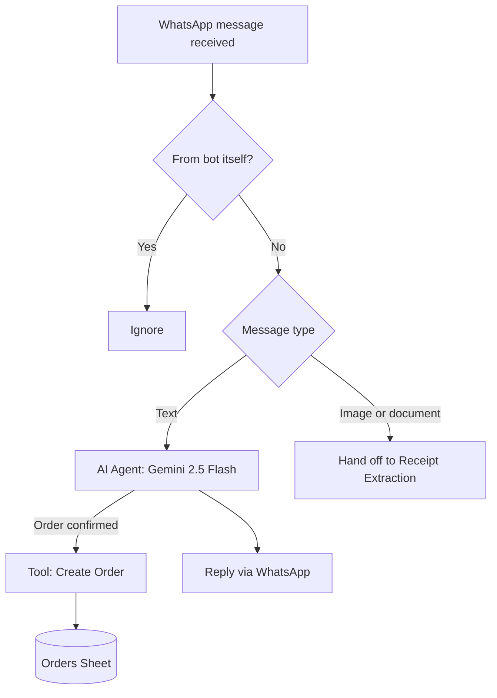
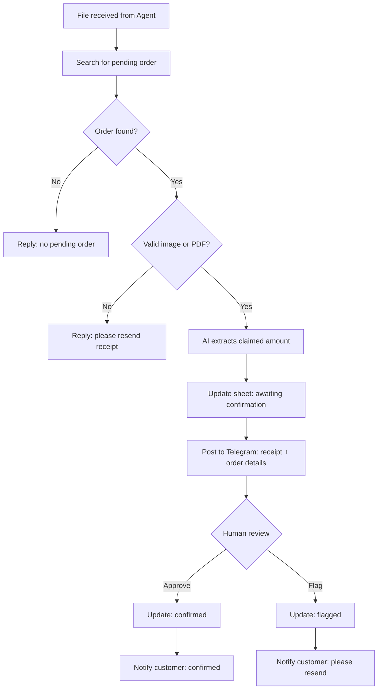

# WhatsApp Ordering Agent with Human-Verified Payment Confirmation

An AI agent that handles customer orders end-to-end over WhatsApp, but deliberately hands payment confirmation to a human, not full automation.

## The Problem

A business wants an AI agent to handle customer orders over WhatsApp from start to finish, but doesn't want to use Paystack, Stripe, or any other payment gateway but manual bank transfers, confirmed manually. That's a harder problem than it sounds: a customer saying "I've paid" isn't proof, and a screenshot of a receipt is trivially easy to fake. The system needs a way to verify a claimed payment is real before the agent tells the customer their order is confirmed without reintroducing the payment gateway the business explicitly doesn't want.

## How This Solves It

An AI agent (Google Gemini, via n8n) handles the ordering conversation and generates an order record through a deterministic tool call, not by writing to the database itself. Once a customer sends proof of payment, an AI extraction step reads the amount off the receipt, but that claim alone never confirms anything. The receipt and order details are posted to a Telegram channel, where a human cross-checks the claim against the real bank alert on their own device before approving or flagging it. Automation handles everything except the one decision that was always meant to stay manual.

## Architecture

### Ordering Agent + Create Order

1. Every incoming WhatsApp message is filtered to exclude the bot's own sent messages, then branched by type
2. Text messages go to the AI Agent, which handles the conversation and extracts item + price
3. Once the customer confirms, the Agent calls a separate, deterministic workflow to generate an order ID and log it. It's kept outside the Agent's own reasoning on purpose
4. The Agent replies with payment instructions and asks for a receipt

### Receipt Extraction + Telegram Approval

1. A received file is matched against this customer's most recent order awaiting payment. No match means no further processing happens
2. The receipt image (or PDF) is read by an AI vision step to extract the claimed amount
3. The order, claimed amount, and receipt image are posted to a Telegram channel with inline Approve/Flag buttons, along with an explicit instruction not to approve from the image alone. Confirm the real bank alert first
4. A separate listener workflow reacts to the button press, updates the order's status, and notifies the customer either way

## Tech Stack

| Component | Tool | Why |
|---|---|---|
| Orchestration | n8n (self-hosted) | Visual workflow builder, native AI Agent + tool-calling support |
| WhatsApp integration | Whapi.Cloud | QR-based WhatsApp API access, no Meta business verification required |
| Conversational AI | Google Gemini 2.5 Flash | Free tier via Google AI Studio, reliable tool-calling |
| Human approval | Telegram Bot API | Inline keyboard buttons, instant push, free |
| Data layer | Google Sheets | Shared state across all four workflows, human-readable audit trail |

## Key Design Decisions

- **The AI Agent never writes to the Orders sheet directly.** Order creation is a separate, deterministic tool call. This keeps the one operation that must be exactly right outside the model's own judgment.
- **Four separate workflows, not one.** Ordering Agent, Create Order, Receipt Extraction, and the Telegram Approval Handler each react to a genuinely different, independently-timed trigger; a WhatsApp message, an internal tool call, an incoming file, and a human's button press, possibly hours later. Merging workflows only makes sense when one step always immediately follows another; none of these four reliably do.
- **A human confirms payment, not an algorithm.** This was the core requirement, not a fallback. Below is why this took three attempts to accept.

## The Pivot Story

This project didn't land on its final design on the first attempt, three automated approaches were tried and rejected for real, concrete reasons, not abandoned out of impatience:

1. **Bank email + transaction ID matching.** The plan was to watch the business's bank alert emails and match the transaction ID against what the customer's receipt claimed. Dead end immediately, the bank's actual credit alert email doesn't include a transaction ID at all, only amount, sender name, and a generic narration.
2. **Monnify virtual accounts.** Moniepoint's payment-collection product generates a dedicated virtual account per customer and fires a clean webhook the moment a transfer lands, this would have solved detection cleanly. Also a dead end: it requires full business registration (CAC, BN) that an individual account doesn't have.
3. **Transfer narration matching.** Have the customer include their order ID in the transfer description, match on that instead of a transaction ID. This actually worked, but it's fragile, since it depends on the customer remembering to type it correctly every time.

The final design: human approval via Telegram, cross-checked against the real bank alert, it turned out to be closer to the original brief than any of the automated attempts. In hindsight, "confirm payments manually" was never a constraint to automate around; it was the actual specification.

## Known Limitations

- A single human reviewer is a bottleneck; no timeout or escalation exists if a payment sits unreviewed for an extended period
- Relies on the reviewer actually checking a real bank alert before approving, the system presents the data clearly but can't enforce that step

## Screenshots

### 1. Full workflow

### 2. WhatsApp Conversation

### 3. Telegram Approval (Before Approval)

### 4. Telegram Approval (After)

### Final WhatsApp confirmation

### Orders Sheet showing Transaction Statuses

---
